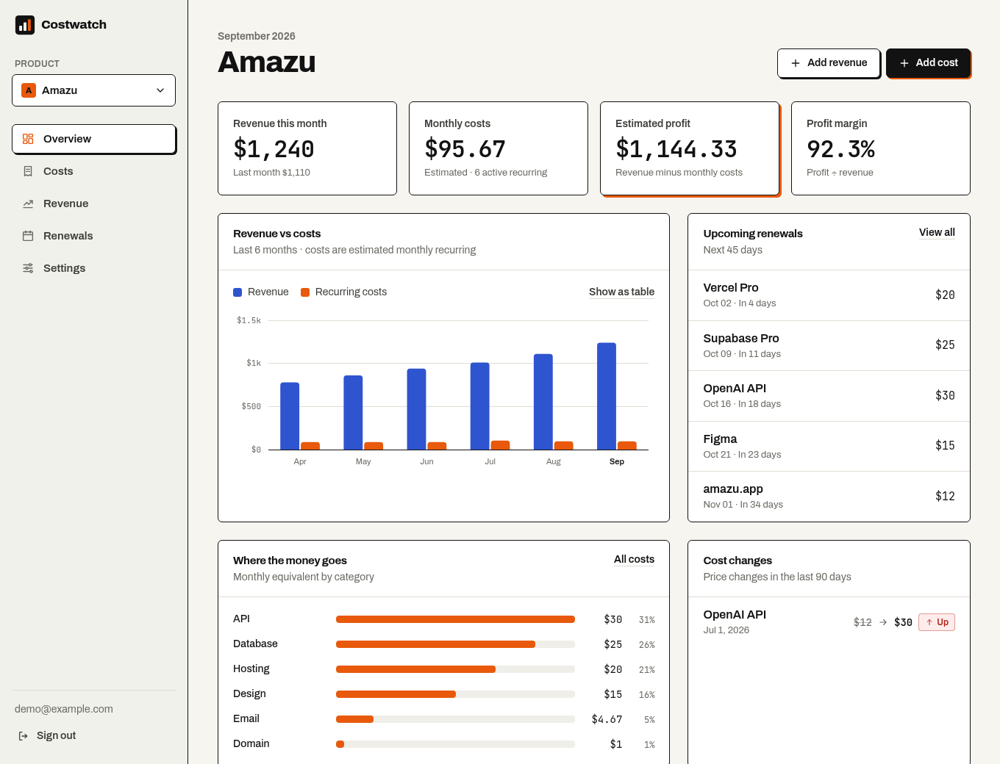
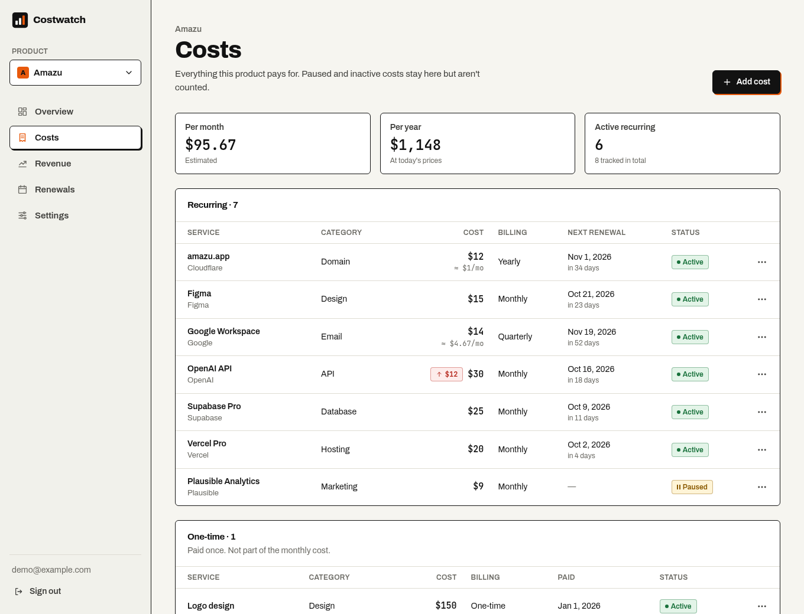
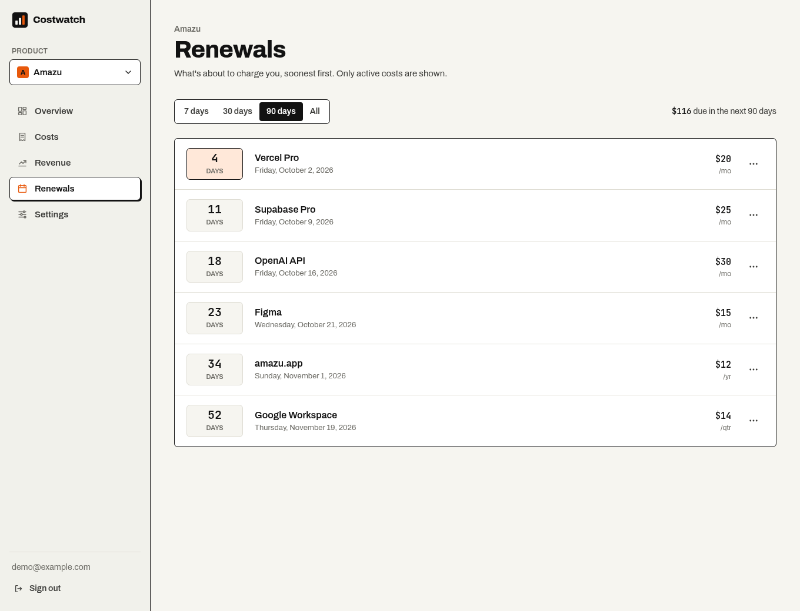
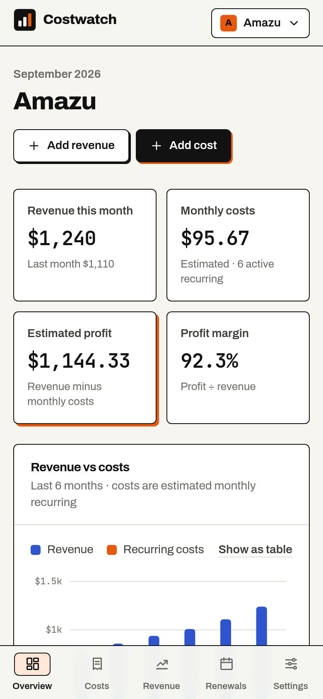

# Costwatch

Know what your product actually costs.

Track product costs, revenue, renewals, and profit in one place.



## The problem

Your side project or small SaaS probably has a hosting bill, a database, an API or two, a
domain, email, design tools and a few other subscriptions. Individually they look small.
Together they're your operating cost, and they're spread across a dozen dashboards,
invoices and card statements.

Most developers know roughly what their product earns. Few can say what it costs to run.
Costwatch gives you one place to answer:

- What am I paying for?
- How much does it cost each month?
- How much am I making, and what's my actual profit?
- What renewals are coming up?
- Which costs are growing?

**Costwatch is not accounting software.** It doesn't do invoicing, taxes, payroll or bank
connections, and nothing in it is financial advice. It's a clear, private view of the real
operating cost of your software product.

## Features

- **Multiple products**, each with its own currency, with a quick product switcher
- **Costs**: monthly, quarterly, yearly, custom-interval or one-time, with category, provider,
  renewal date and notes. Pause a cost or mark it inactive without losing its history.
- **Monthly estimate**: every recurring cost is converted to a monthly equivalent (clearly
  labelled as an estimate)
- **Revenue**: fast manual entry, grouped by month with that month's costs and profit
- **Profit and margin**, with no divide-by-zero surprises when there's no revenue yet
- **Renewals**: what charges you in the next 7, 30 or 90 days. Past renewal dates are
  projected forward and marked as estimated.
- **Cost history**: price and status changes are recorded automatically, so you can see which
  costs are growing and how your monthly cost has changed
- **Honest currencies**: amounts in other currencies are shown separately and never silently
  converted
- **CSV export** of costs and revenue, and full account deletion
- **Private by default**: every row is protected by Postgres Row Level Security
- Responsive, keyboard-accessible, and respects reduced motion

| Costs | Renewals | Mobile |
| --- | --- | --- |
|  |  |  |

## Tech stack

- [Next.js](https://nextjs.org) 16 (App Router, Server Actions), TypeScript, Tailwind CSS 4
- [Supabase](https://supabase.com): PostgreSQL, Auth, Row Level Security
- Hand-rolled SVG charts (no chart library)

No separate backend server: the Next.js app talks to Supabase as the signed-in user.

## Repository layout

```text
costwatch/
├── web/                  Next.js application
│   ├── app/              Routes: landing, docs, auth, /app dashboard, server actions
│   ├── components/       UI primitives, charts, forms, app shell
│   ├── lib/              calc.ts (all money math), data/ (server-only data access), validation
│   └── types/            Database types
├── supabase/
│   ├── migrations/       Schema, RLS policies, triggers
│   └── seed.sql          Demo data for local development only
└── docs/                 Architecture, calculations, self-hosting
```

## Local development

### Requirements

- Node.js 20.9+ (22 recommended, see `.nvmrc`)
- Docker, for the Supabase CLI's local stack (or use a hosted Supabase project)

### 1. Start Supabase

```bash
git clone https://github.com/App-Chef/costwatch.git
cd costwatch
npx supabase start       # Postgres, Auth, Studio and a local email inbox
npx supabase db reset    # applies migrations and loads demo seed data
```

`npx supabase status` prints the API URL and anon key you need next.

### 2. Configure the app

```bash
cd web
cp .env.example .env.local
```

### Environment variables

| Variable | Required | Description |
| --- | --- | --- |
| `NEXT_PUBLIC_SUPABASE_URL` | Yes | Supabase API URL (`http://127.0.0.1:54321` locally) |
| `NEXT_PUBLIC_SUPABASE_ANON_KEY` | Yes | Supabase anon / publishable key. Safe in the browser because RLS protects all data. |
| `NEXT_PUBLIC_SITE_URL` | Production | Public URL, used for auth email links, sitemap and social previews |
| `NEXT_PUBLIC_AUTH_GOOGLE_ENABLED` | No | `true` to show "Continue with Google" (configure the provider in Supabase first) |

Costwatch never needs the `service_role` key. Don't add it.

### 3. Run the application

```bash
npm install
npm run dev
```

Open http://localhost:3000. Sign in with the **demo account** `demo@example.com` /
`costwatch-demo`, or create your own. The demo products ("Amazu" and "Financ") and all
their numbers are made-up example data.

## Supabase setup (hosted)

1. Create a project at [supabase.com](https://supabase.com/dashboard).
2. Push the schema:
   ```bash
   npx supabase login
   npx supabase link --project-ref <your-project-ref>
   npx supabase db push
   ```
   Or run each file in `supabase/migrations/` in order in the SQL editor.
   **Do not load `seed.sql` into production.**
3. In **Authentication → URL Configuration**, set the Site URL and add
   `https://your-domain.com/auth/callback` to the redirect URLs.
4. Configure custom SMTP before inviting real users (Supabase's default sender is heavily
   rate-limited).
5. Optional: enable the Google provider and set `NEXT_PUBLIC_AUTH_GOOGLE_ENABLED=true`.

The full guide is in [docs/self-hosting.md](docs/self-hosting.md) and at `/docs` in the app.

## Database migrations

Migrations live in `supabase/migrations/` and are applied in filename order.

- New changes go in a **new** migration file. Never edit a released migration.
- Every table with user data must enable RLS, define policies, and set explicit grants.
- After changing the schema, update `web/types/database.ts` (or regenerate it with
  `npx supabase gen types typescript --local`).

## Checks

```bash
cd web
npm run lint          # ESLint
npm run typecheck     # TypeScript
npm run build         # production build
```

CI runs all of these on every pull request (`.github/workflows/ci.yml`).

## How the numbers work

- **Monthly cost** = sum of the monthly equivalents of *active* recurring costs in the product's
  currency: yearly ÷ 12, quarterly ÷ 3, custom by interval length.
- **Estimated profit** = revenue recorded this month − monthly cost.
- **Profit margin** = profit ÷ revenue × 100, or "No revenue recorded" when revenue is zero.
- One-time costs are listed on their own and aren't part of the monthly cost.

Details and edge cases are in [docs/calculations.md](docs/calculations.md).

## Contributing

Contributions are welcome. Please read [CONTRIBUTING.md](CONTRIBUTING.md) and our
[Code of Conduct](CODE_OF_CONDUCT.md) first.

## Security

Please report vulnerabilities privately. See [SECURITY.md](SECURITY.md).

## License

[MIT](LICENSE)
